# Altuni AI Labs — Investment Research Agent Node

An autonomous, real-time AI-powered Investment Research Agent that performs rigorous financial due diligence, competitor evaluation, and sentiment analysis on public companies, synthesizing a definitive investment decision (**INVEST** or **PASS**) with detailed bull/bear reasoning.

Built with **Next.js (App Router, TypeScript)**, **LangChain.js / LangGraph.js**, and **Yahoo Finance**, this application features a high-fidelity, responsive dark-mode dashboard reflecting modern enterprise SaaS design aesthetics.

---

## 🌟 Overview

The Investment Research Agent automates the workflow of an equity research analyst. Given a company name (e.g. "Apple" or "Tesla"), the agent initiates a multi-stage reasoning graph, streams progress logs in real-time, compiles financial statistics, renders historical stock charts, and produces a structured investment memorandum.

### Core Features
*   **Real-time Agentic Pipeline**: Powered by LangGraph.js, executing a structured directed acyclic graph (DAG) of research nodes.
*   **Live Logging Console**: A terminal interface that streams step-by-step agent logs directly to the frontend using NDJSON chunked streaming.
*   **Live Graph Visualizer**: A visual representation of the active graph pipeline, indicating which node is currently processing.
*   **Yahoo Finance Integration**: Fetches real-time price quotes, balance sheet metrics (margins, current ratio, debt-to-equity, ROE), and 12-month historical stock prices.
*   **Robust Search Fallback**: Gathers market sentiment using Tavily or SerpAPI, with an automated, free HTML scraper fallback.
*   **Interactive Recharts Stock Graph**: Visualizes historical performance with custom tooltips.
*   **SWOT & Thesis Analysis**: Categorizes results into SWOT cards, bull/bear checklists, and a PDF-style Executive Memorandum.
*   **Research Vault (History)**: Caches past analysis runs in `localStorage` for easy comparative reviews.
*   **Multi-Provider LLM Integration**: Dynamically supports **Google Gemini** (`gemini-1.5-flash`) and **OpenAI** (`gpt-4o-mini`).
*   **API Key Management**: Keys can be configured in the UI settings drawer or loaded from server environment variables.

---

## 🚀 How to Run It

### 1. Prerequisites
Ensure you have [Node.js](https://nodejs.org) (v18.0.0 or higher) and `npm` installed.

### 2. Installation
Extract the zip package, navigate to the directory, and install dependencies:
```bash
npm install
```

### 3. Environment Configuration (Optional)
Create a `.env.local` file in the root directory:
```env
# LLM Provider Key (Set at least one)
GEMINI_API_KEY=your_gemini_api_key_here
OPENAI_API_KEY=your_openai_api_key_here

# Search API Key (Optional - falls back to scraper if blank)
TAVILY_API_KEY=your_tavily_api_key_here
SERPAPI_API_KEY=your_serp_api_key_here
```
*Note: If no API keys are provided in the environment, you can enter them directly in the browser UI by clicking the **Settings** button in the header.*

### 4. Development Server
Run the local development server:
```bash
npm run dev
```
Open [http://localhost:3000](http://localhost:3000) in your web browser.

### 5. Production Build
Verify compilation and run production:
```bash
npm run build
npm run start
```

---

## 🛠️ How It Works (Approach & Architecture)

The application uses a unified Next.js architecture combining a React client dashboard with a Node.js server route executing the LangGraph agent.

### The LangGraph Workflow
The agent's reasoning flow is organized as a State Graph using `@langchain/langgraph`:

```mermaid
graph TD
    Start((Start)) --> Resolve[resolveTicker]
    Resolve --> Fetch[fetchFinancials]
    Fetch --> Search[searchNews]
    Search --> Analyze[analyzeFundamentals]
    Analyze --> Risk[assessRisks]
    Risk --> Synthesize[synthesizeDecision]
    Synthesize --> End((End))
    
    style Resolve fill:#1e293b,stroke:#6366f1,stroke-width:2px;
    style Fetch fill:#1e293b,stroke:#6366f1,stroke-width:2px;
    style Search fill:#1e293b,stroke:#6366f1,stroke-width:2px;
    style Analyze fill:#1e293b,stroke:#6366f1,stroke-width:2px;
    style Risk fill:#1e293b,stroke:#6366f1,stroke-width:2px;
    style Synthesize fill:#1e293b,stroke:#10b981,stroke-width:2px;
```



1.  **`resolveTicker`**: Resolves the user's plain-text query (e.g. "Apple") to a stock symbol ("AAPL") via Yahoo Finance's autocomplete API, falling back to LLM entity recognition if unsuccessful.
2.  **`fetchFinancials`**: Retrieves balance sheet summary parameters and 12-month historical stock prices.
3.  **`searchNews`**: Gathers market headlines regarding the stock's recent performance and headwinds.
4.  **`analyzeFundamentals`**: Prompts the LLM to inspect liquidity ratios, debt safety limits, cash yields, and pricing power.
5.  **`assessRisks`**: Summarizes competitive disruption, macroeconomic variables (inflation, interest rates), and regulatory concerns.
6.  **`synthesizeDecision`**: Reviews all compiled findings to draft the bull/bear checklist, 12M target price range, confidence conviction score, and the final verdict (**INVEST** or **PASS**).

### NDJSON Real-time Streaming
To provide a premium user experience, the api endpoint uses a chunked `ReadableStream` returning Newline-Delimited JSON (NDJSON). As each node in the LangGraph finishes execution, it updates the state logs and values, which are immediately pushed down the stream. The React frontend reads this stream chunk-by-chunk, updating the visualizer, logging terminal, stock charts, and report tabs in real-time.

---

## ⚖️ Key Decisions & Trade-offs

### 1. Unified Next.js Stack vs. Separate Backend/Frontend
*   **Decision**: We chose Next.js App Router to implement both React frontend components and server routes in a single repository.
*   **Why**: It simplifies deployment (e.g. on Vercel) and local configuration, while allowing server-side code (Node.js runtime) to fetch public Yahoo APIs, scrape websites, and invoke models securely without exposing developer API keys to the client.

### 2. Yahoo Finance Wrapper (`yahoo-finance2`) vs. Paid Financial APIs
*   **Decision**: We used the public `yahoo-finance2` library instead of paid APIs (like AlphaVantage or Bloomberg).
*   **Why**: It provides real-time equity parameters, income statements, and monthly chart paths without requiring registration or paid keys. This ensures the reviewer can compile and run the application instantly without requesting demo tokens.

### 3. Graceful Fallback Architecture
*   **Decision**: Built comprehensive `try-catch` structures inside all graph nodes.
*   **Why**: If a search request fails (e.g. network/SSL interception issues) or the user's LLM keys fail, the agent logs the error in the streaming console and immediately falls back to mock news/ratios or standard mock analyses rather than crashing. This ensures the dashboard always displays a complete, working outcome.

### 4. Custom JSON Extraction vs. LangChain Structured Output
*   **Decision**: We implemented manual regex-based JSON extraction from markdown blocks rather than LangChain's strict output parsers.
*   **Why**: Different model providers (Gemini vs. OpenAI) handle tool calls and JSON mode schemas slightly differently in LangChain. By prompting the models to return clean JSON blocks and using a robust parser that extracts text between the first `{` and last `}`, we achieved a universal parser that works across all LLMs.

---

## 📈 Example Runs

### 1. Tesla Inc. (TSLA)
*   **Verdict**: `Hold` / `PASS`
*   **Confidence**: `75%`
*   **Target Price Range**: `$190.00 - $225.00`
*   **Core Bull Thesis**:
    *   Unrivaled battery supply chain vertical integration.
    *   Strong capital reserve buffer with low leverage indicators.
*   **Core Bear Thesis**:
    *   Rising competition from Chinese EV incumbents impacting global operating margins.
    *   Regulatory headwinds on driver-assistance features representing legal drag.
*   **Executive Summary Snippet**: Tesla's market positioning remains structurally dominant, supported by capital depth and vertical manufacturing advantages. However, margins are contracting due to global price wars and competitor encroachment. A Hold position is recommended until autonomous vehicle regulatory frameworks normalize and margin stabilization is established.

### 2. Apple Inc. (AAPL)
*   **Verdict**: `Buy` / `INVEST`
*   **Confidence**: `88%`
*   **Target Price Range**: `$315.00 - $360.00`
*   **Core Bull Thesis**:
    *   Strong consumer pricing power and sticky ecosystems.
    *   Industry-leading return on equity (ROE > 100%) and free cash flow generation.
*   **Core Bear Thesis**:
    *   Antitrust challenges in multiple jurisdictions.
    *   Device replacement cycles lengthening.

---

## 💡 Future Improvements (With More Time)
1.  **Multi-Agent Debate Node**: Implement a debate model where a Bull Analyst Agent and a Bear Analyst Agent argue the company's valuation before the final verdict is synthesized.
2.  **PDF Report Export**: Add a frontend button that compiles the generated investment memo, financial charts, and SWOT grid into a formatted PDF.
3.  **Database Storage**: Integrate PostgreSQL or Supabase to persist history across different browser sessions.
4.  **SEC Edgar Integration**: Add a node that pulls the latest 10-K and 10-Q filing documents directly from the SEC SEC Edgar search system for deep financial parsing.

---

## 📝 Bonus Points: LLM Chat session logs
The complete, untruncated conversation history and chat logs detailing the pairing session between the agent developer and the AI programming assistant are included inside this project:
*   📁 **Chat Logs Directory**: [chat_logs/](file:///d:/study/Investmentagent/chat_logs/)
*   📄 **Full Transcript (JSONL)**: [chat_logs/transcript_full.jsonl](file:///d:/study/Investmentagent/chat_logs/transcript_full.jsonl)
*   📄 **Compact Transcript (JSONL)**: [chat_logs/transcript.jsonl](file:///d:/study/Investmentagent/chat_logs/transcript.jsonl)

This transcript logs all command-line operations, debugging cycles (fixing Google Font compilation blockades and casting Yahoo Finance null fields), and layout decisions.
